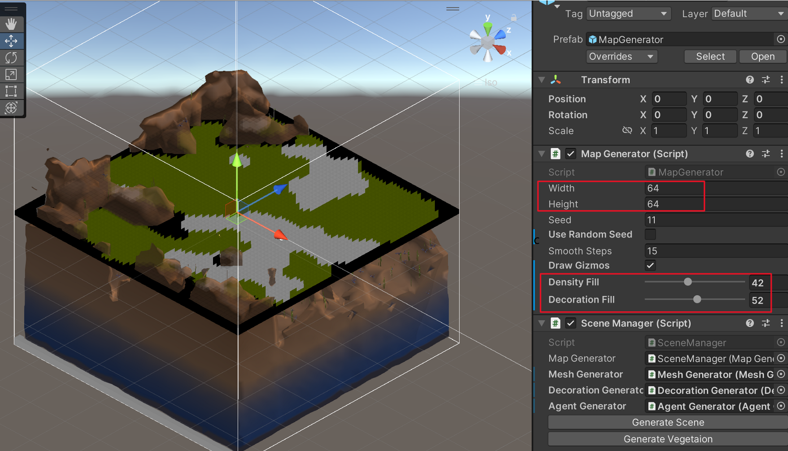
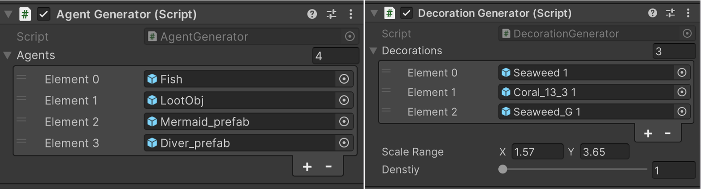

# UnderseaPCG
The project is to construct undersea world by PCG methods
## Video Demonstration
* The video demonstration is available to view [here](https://youtu.be/Pa8juTHpo8c).
## Introduction
<p align="center">
    
</p>
This project was built for the Interactive Agents and Procedural Generation (ECS7016P) module at Queen Mary, University of London.
* The aim of the project is to simulate the undersea environmnet.
* The terrain is procedurally generated by two techniques: cellular automata and marching cubes
* The npc is controlled by behavior trees
* Fish group is developed on Boid

## Technique
Features in the project are list as follows:

**Cellular Automata**: Generate density map and decoration map, which are required for 3D Terrain and the vegetation on it.

**Marching Cubes** : Generate triangular meshed according to the voxel density.

**Force-based steering**: Controll the movement of Game objects, such as seek, flee, path following, avoid collision.

**Behavior Tree** : Controll AI behavior

**Utility agent**: Controll AI logic

**Compute Shader**: Put the most time-consuming calculation on GPU side, such as mesh generation, fish animation

**Command Buffer**: To postprocess the render from camera, adding special effect like screen-based depth and distortion to simulate the undersea effect.

## Setup
* This project was developed on Unity version `2022.3.18f1`.
* The scene file is at `Assets/Scenes/undersea.unity`

## Project hierarchy
```commandline
📦Assets
 ┣ 📂Scenes                         // Main Scene
 ┃ ┗ 📜undersea.unity                   
 ┣ 📂Scripts                        // Main scripts for PCG and NPC behaviour
 ┃ ┣ 📂Agent                        // Movement control and agent behavior
 ┃ ┃ ┣ 📜...MoveUnit.cs             // Combination of various steer behavior
 ┃ ┃ ┣ 📜...Controller.cs           // Initialization and Behavior tree logic
 ┃ ┣ 📂Generator                    // Procedural generator
 ┃ ┃ ┣ 📜AgentGenerator.cs          // Create agnets
 ┃ ┃ ┣ 📜DecorationGenerator.cs     // Create vegetation
 ┃ ┃ ┣ 📜MeshGenerator.cs           // Create mesh
 ┃ ┃ ┣ 📜MapGenerator.cs            // Create relatively genotype map
 ┃ ┣ 📂Others                       // Camera, UI, Scene 
 ┣ 📂Lib3rd                         // Specific features
 ┃ ┣ 📂Fish                         // Boid system
 ┃ ┣ 📂MarchingCube                 // Mesh generation
 ┃ ┣ 📂NPBehave                     // Behavior Tree
 ┗ ┗ 📂Steer                        // Steer system
 ```

##  Procedural Generation
The Terrain is generated based on an 64 x 64 grid, which is created By [Cellular Automata](https://www.youtube.com/watch?v=v7yyZZjF1z4). *Wanrning:The prototype is built and tested only on the fixed size of 64x64*, other setting may lead to errors. The map generation creates two map: density map and vegetation map. The former is used to affect the shape of terrain, the latter indicates the area where the decoration will be assigned.
<p align="center">
    
</p>
<p align="center">
<p align="center">
    <b>Fig. 1: Map generator</b>
</p>

During the process of trangularization of [Marching Cubes](https://www.youtube.com/watch?v=M3iI2l0ltbE), the density map affects the density value of voxel, shaping the final result.

After mesh generation, decoration and agent generators places agents and vegetation on the terrain.
<p align="center">
    
</p>
<p align="center">
<p align="center">
    <b>Fig. 2: agent and decoration generator</b>
</p>

Given that the most of computation for animation and triangulisation occurs on GPU size, the whole process is fast enought to work in real-time.


## Interactive Agents
### Diver


* The diver has two modes for control:  Mannul and Auto mode. Mannual mode can be controlled by using the keyboard w,a,s,d. In auto mode, the agent will follow the path which is created when the agent is instantiated.

### Mermaid

* The Mermaid is controlled by behavior tree. It roams around the area until detecting a nearby lootable object, then it will enter into seek mode to pursue the lootable object.

### Lootable object
* The lootable object follow a set path, automatically moving to the next point when captured by a mermaid

### School of fish

* The fish movement is modeled using a boid system, with each fish's animation processed on the GPU for efficiency. Their interactive behavior is governed by a mix of utility systems and behavior trees. In short, when a diver is nearby, the fish may gather around in terms of distance; if not, they'll navigate along predetermined paths.

## Future Improvements
* As the marching cubes support multiple chunks, the map generator can be improved to be created on chunk as well so that it can support building an infinite world. 
* Improve terrain shader
* Improve vegetaion animation and shader
* Add more types of creatures
